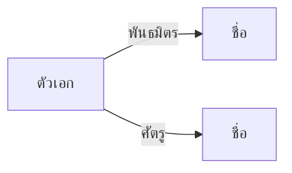

# 👥 ตัวละคร

> [!warning] อัปเดตแค่ที่เจอแล้ว
> ห้ามเติมตัวละครที่ยังไม่โผล่ในเกม — สปอยล์

## ตารางรวม

| ชื่อ | ฝ่าย | บทบาท | เจอครั้งแรก | สถานะล่าสุด |
|---|---|---|---|---|
| | พันธมิตร / ศัตรู / เป็นกลาง | | บทที่ | มีชีวิต / ตาย / หายตัว |

---

## <ชื่อตัวละคร>

- **ฝ่าย:** 
- **ความสัมพันธ์กับตัวเอก:** 
- **เป้าหมายของเขา/เธอ:** 
- **เจอครั้งแรก:** บทที่ · ที่ไหน
- **สถานะล่าสุด:** 

**เรื่องที่เกี่ยวข้อง**
<สรุปสิ่งที่ตัวละครนี้ทำในเรื่อง เรียงตามเวลา>

**เกี่ยวกับเกมเพลย์**
- ให้เควส: 
- ขายของ / สอนสกิล: 
- ⚠️ **มีของพลาด:** <ถ้าไม่คุยก่อนบทนี้ จะหายไป> → ลิงก์ [[Missables]]

---

## แผนผังความสัมพันธ์

